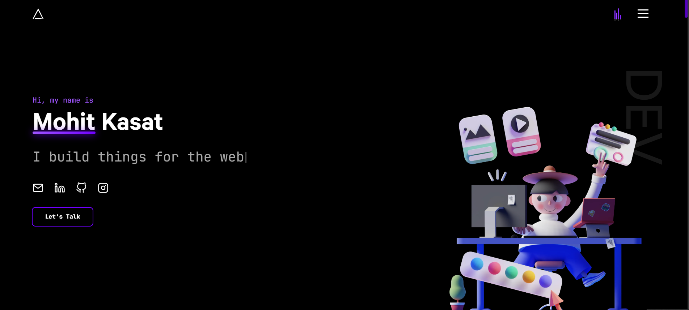

# Devfolio 🚀

[](https://portfolio-mohit-gamma.vercel.app/)

<p align="center">
  
  <a href="#" target="_blank">
    
  </a>
  
</p>

## 👨‍💻 Developer Portfolio
### A Sleek and Modern Portfolio to Showcase Your Work
This portfolio is designed for developers who want to **stand out** with an elegant, interactive, and professional web presence. Built using **Next.js, GSAP (GreenSock Animation Platform), Tailwind CSS, and React**, this portfolio ensures smooth animations, responsiveness, and a great user experience.

### ✨ [Live Demo](https://portfolio-mohit-gamma.vercel.app/)

## 🛠️ Technologies Used
This project leverages modern web development technologies to create a high-performance and visually appealing portfolio:

- **Next.js** – A powerful React framework for fast and optimized applications.
- **GSAP** – Ensures smooth animations and enhanced interactivity.
- **Tailwind CSS** – A utility-first CSS framework for styling with flexibility.
- **React.js** – The core framework for building dynamic UI components.

## 🚀 Getting Started
Follow these steps to set up and run the project locally:

### Prerequisites
Ensure you have the following installed on your system:
- **Node.js** (v16 or later recommended)
- **Yarn** (or npm as an alternative)

### Installation & Setup
Clone the repository and install dependencies:

```bash
# Clone the repository
git clone https://github.com/your-username/your-portfolio.git

# Navigate to the project folder
cd your-portfolio

# Install dependencies
yarn install

# Start the development server
yarn dev
```

Once the server is running, open [`http://localhost:3000`](http://localhost:3000) in your browser to view the project.

## 🎨 Design & Customization
The portfolio is designed with flexibility in mind. You can easily:
- Update content in the **components** folder.
- Modify styles using **Tailwind CSS**.
- Customize animations with **GSAP**.

## 🔥 Features
✅ **Smooth animations** powered by GSAP
✅ **Dark Mode Support** for better readability
✅ **Responsive Design** that works across all devices
✅ **SEO Optimized** for better visibility
✅ **Easy Deployment** via Vercel

## 🎭 Inspirations & Credits
This portfolio draws inspiration from modern web design trends and animation techniques. Feel free to take ideas from the design and customize it as per your needs. 😊

## 🍴 Forking & Attribution
I love seeing others use and improve upon my work! If you fork this repository:
- **Provide proper attribution** by linking back to this repository.
- **Keep the footer intact** as a small acknowledgment of my work.
- **Consider giving a star ⭐** if you find this project useful!

## 📢 Feedback & Support
If you have any suggestions, issues, or feedback, feel free to **open an issue** or **reach out to me** via:
- **Email:** mohitkasat83@gmail.com
- **LinkedIn:** [Your Profile](https://www.linkedin.com/in/mohitkasat/)

### 🤝 Contributing
Want to contribute? Feel free to submit a pull request. Let’s make this project even better together!

---

🎉 **Thank you for checking out this project! I hope it helps you build an impressive online presence.** 🚀

